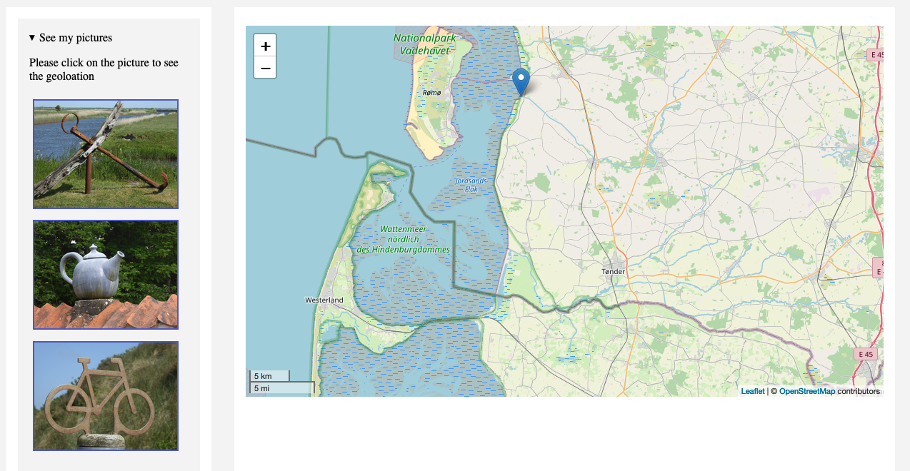

# javascript html leaflet images

Displays the geolocation (position) from the selected image (by click) on the map.
I used a csv input variable created by exiftool and a  element for all images.
The csv input is converted into json object.

The pictures (copyright by myself) are from the last bicycle tour in Danmark.

I use the flyTo() method to set the marker on this specific position. The marker tooltip shows a small thumbnail of the picture. A click on this marker displays a popup menue with a link to this image.

Note: For further information: ([see Leaflet docs](http://leafletjs.com/reference.html#latlng)).

---

MIT License
